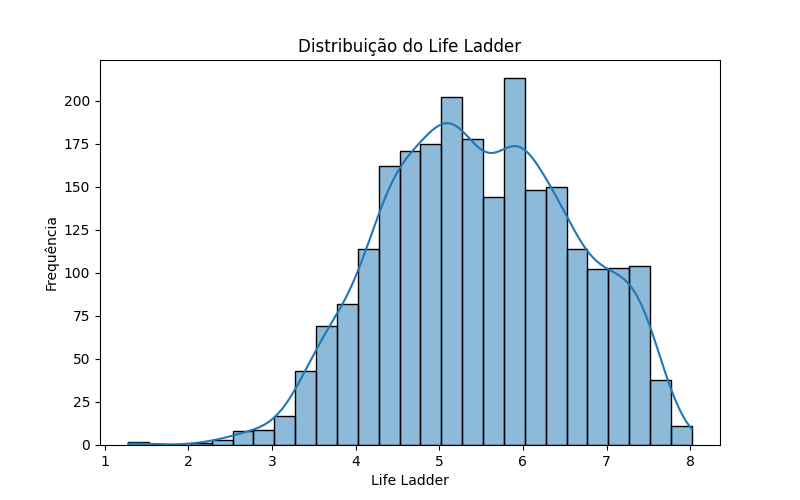
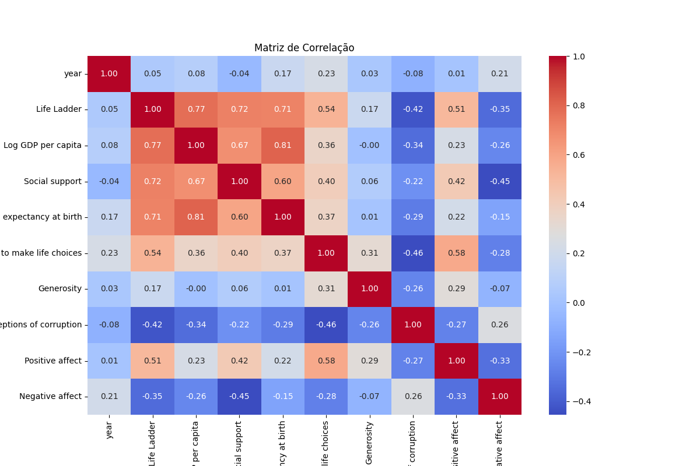

# **World Happiness Prediction**

## **1. Introdução**
Neste projeto, utilizamos análise de dados e aprendizado de máquina para compreender os fatores que impactam a felicidade mundial. A felicidade de um país é representada pela variável `Life Ladder` (pontuação de felicidade), baseada em indicadores econômicos, sociais e ambientais.

### **Objetivo**
Prever o score de felicidade (`Life Ladder`) de diferentes países com base em variáveis socioeconômicas e identificar os fatores que mais influenciam esse score.

---

## **2. Coleta de dados**
### **Fonte**
Os dados foram obtidos do [Kaggle - World Happiness Report 2024](https://www.kaggle.com/datasets/muskanmaheshwari15/world-happiness-data-2024).

### **Como obter os dados**
1. Acesse o link acima no Kaggle.
2. Clique em **Download** para obter:
   - O arquivo `world-happiness-data-2024.zip`:
     - Caso o arquivo seja baixado como `archive.zip`, renomeie-o para `world-happiness-data-2024.zip`.
   - Ou diretamente o arquivo `World Happiness Report 2024.csv`:
     - Neste caso, você verá um aviso no código de que não conseguiu descompactar um arquivo. Não se preocupe, isso não afetará o funcionamento.
3. Coloque o arquivo (zip ou CSV) na mesma pasta onde o código `code.py` está localizado.


### **Descrição dos dados**
As principais colunas utilizadas no modelo foram:
- **Life Ladder**: Pontuação de felicidade.
- **Log GDP per capita**: PIB per capita (logarítmico).
- **Social support**: Suporte social.
- **Healthy life expectancy at birth**: Expectativa de vida saudável ao nascer.
- **Freedom to make life choices**: Liberdade para tomar decisões.
- **Positive affect**: Emoções positivas.
- **Perceptions of corruption**: Percepção de corrupção.

### **Processo**
1. Valores ausentes foram preenchidos com a média para cada coluna numérica.
2. Variáveis categóricas (como `Country name`) foram excluídas da análise.

---

## **3. Requisitos**
Certifique-se de ter as bibliotecas abaixo instaladas no seu ambiente Python antes de executar o código:
- **os** (padrão no Python)
- **zipfile** (padrão no Python)
- **pandas**: `pip install pandas`
- **matplotlib**: `pip install matplotlib`
- **seaborn**: `pip install seaborn`
- **scikit-learn**: `pip install scikit-learn`
  
---

## **4. Modelagem**
### **Modelo Utilizado**
Optamos por usar **Regressão Linear**, um modelo estatístico simples e eficaz para prever valores contínuos.

### **Configuração**
- Dados divididos em treino (80%) e teste (20%).
- Métricas de avaliação:
  - **MSE (Mean Squared Error)**: 0.31.
  - **R² Score**: 0.76.

### **Resultados**
- O modelo explicou 76% da variação no score de felicidade.
- Variáveis mais impactantes:
  - **Log GDP per capita** (PIB per capita): Correlação de 0.77.
  - **Social support** (Suporte social): Correlação de 0.72.
  - **Healthy life expectancy at birth**: Correlação de 0.71.
  - **Perceptions of corruption** (Percepção de corrupção): Correlação de -0.42.

---

## **5. Visualizações**
### **Distribuição do Life Ladder**


### **Matriz de Correlação**


### **Valores Reais vs Previsões**


---

## **6. Conclusões**
### **Insights**
1. Países com maior PIB per capita, suporte social e expectativa de vida saudável tendem a ter maiores níveis de felicidade.
2. A percepção de corrupção reduz significativamente a felicidade de um país.

### **Limitações**
- O modelo não captura completamente a complexidade dos fatores que afetam a felicidade.
- Dados ausentes podem influenciar os resultados.

### **Aplicações**
Este projeto pode ajudar formuladores de políticas a identificar os fatores mais críticos para melhorar a qualidade de vida em diferentes países.

---

## **7. Reproduzir o Projeto**
### **Passos**
1. Faça o download do dataset no [Kaggle](https://www.kaggle.com/datasets/muskanmaheshwari15/world-happiness-data-2024).
2. Coloque o arquivo `world-happiness-data-2024.zip` na mesma pasta do arquivo `code.py`.
3. Descompacte o arquivo e renomeie para `world_happiness_2024.csv`, caso necessário:
   ```python
   import zipfile
   import os

   with zipfile.ZipFile('world-happiness-data-2024.zip', 'r') as zip_ref:
       zip_ref.extractall(".")
   os.rename("World Happiness Report 2024.csv", "world_happiness_2024.csv")

---

## **8. Contato**
Criado por Gustavo Francisco Lima de Oliveira.  
E-mail: g.francisco.tech@gmail.com.

---

